## Exercise 3: Enable Backup for the Contoso application

Duration: 30 minutes

In this exercise, you will use Azure Backup to enable backup for the Contoso application. You will configure backup for both the web tier VMs and the SQL Server database.

### Task 1: Create the Azure Backup resources

Azure Backup and Azure Site Recovery are implemented using the same Azure resource type, the Recovery Services Vault. However, for Azure Backup the vault must be deployed to the same region as the resources being protected, in this case the primary site. In contrast, for Azure Site Recovery the vault was deployed to the secondary region.  In this task, you will create the vault in the primary region for use by Azure Backup.

1. From the Azure portal, search and select **Recovery Services Vault** then select **Create**.

    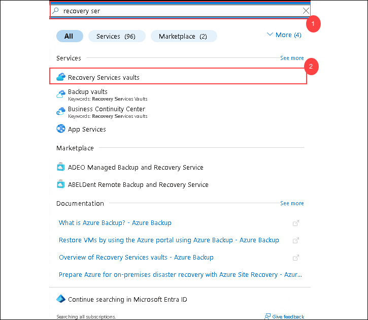

2.  Complete the **Recovery Services Vault** blade using the following inputs, then select **Review and Create**, followed by **Create**:

    - **Resource Group**: **ContosoRG1 (1)**
    - **Name**: **BackupRSV (2)**
    - **Location**: **<inject key="Region" enableCopy="false" />** *(Primary Region)(3)*

    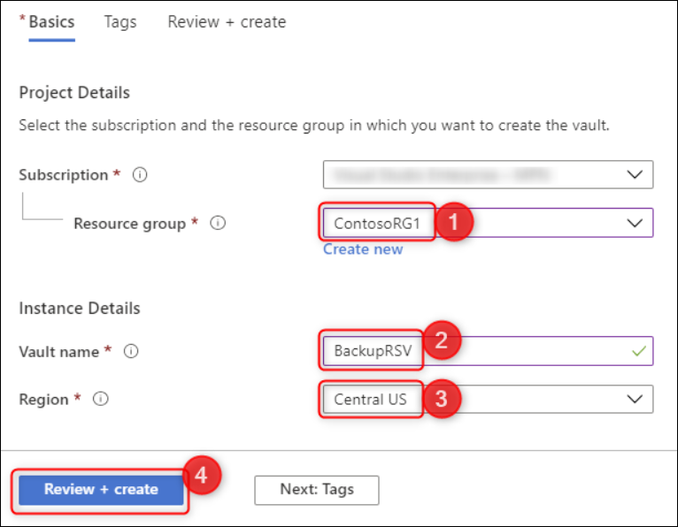

3. Once the deployment completes, navigate to the **BackupRSV** resource, select **Properties** and **Backup Configuration**.

    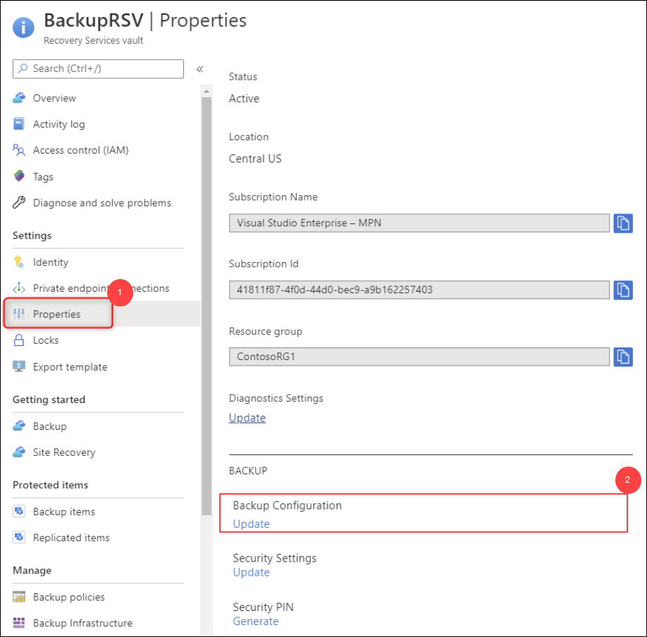

4.  Under **Backup Configuration**, select **Update**. In the Backup Configuration blade, check that the storage replication type is set to **Geo-redundant** and set the Cross Region Restore option to **Enable** then **Apply** your changes and close the Backup Configuration panel.

    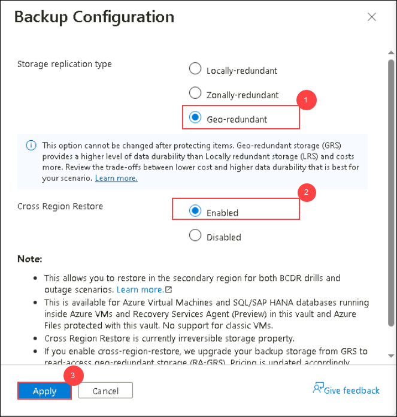

    > **Note:** This enables backups from the primary site to be restored in the DR site, if required.

5.  Still in the BackupRSV Properties blade, under **Soft Delete and security settings**, select **Update**. Under Soft Delete, select **Uncheck** the **Enable soft delete for cloud workloads** and** Enable soft delete and security settings for hybrid workloads**, then **Update** your changes and close the Security Settings panel.

    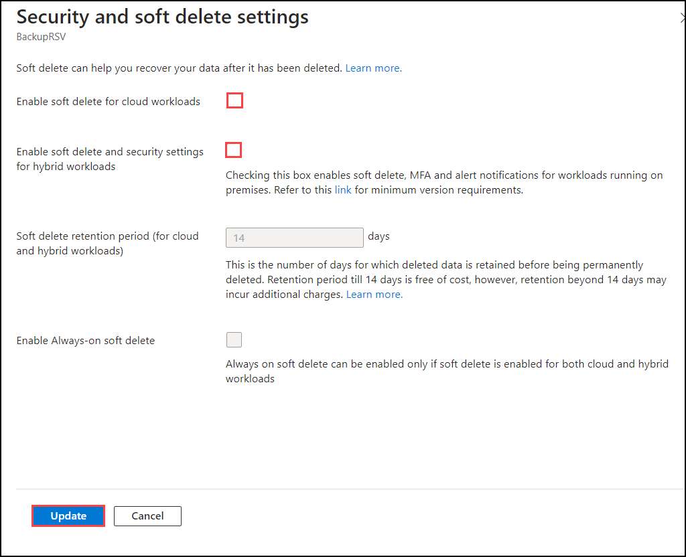

    > **Note:** In a production environment, you should leave Soft Delete enabled. However, for this lab, it is better to disable this feature, since leaving it enabled makes it more difficult to clean up your lab resources once the lab is complete.

### Task 2: Enable Backup for the Web tier

In this task, you will configure Azure Backup for the Web tier virtual machines. Of course, if the Web VMs are stateless, backup  may not be required, so long as the VM image and/or application installation are protected.

1.  From the **BackupRSV** Recovery Services vault blade, under 'Getting Started', select **Backup (1)**. Under 'Where is your workload running?', select **Azure(2)**. Under 'What do you want to backup?', select **Virtual machine(3)**. Then select **Backup(4)**.

    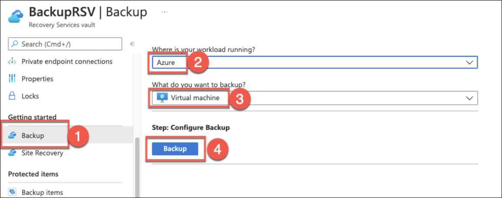

2.  On the 'Configure Backup' blade, Leave **Standard** selected and select **Create a new policy** and fill in the Create Policy blade as follows:

    - **Policy name**: `WebVMPolicy`(1)
    - **Backup schedule**: Daily, 9pm, UTC (2)
    - **Retain instant recovery snapshots for**: 2 day(s) (3)
    - **Retention of daily backup point**: Enabled, 180 days (4)
    - **Retention of weekly backup point**: Enabled, Sunday, 12 weeks (5)
    - **Retention of monthly backup point**: Enabled, First Sunday, 24 months (6)
    - **Retention of yearly backup point**: Enabled, day-based, January 1, 5 years (7)
    - **Azure Backup Resource Group**: ContosoBackupRG (8)

    When finished, select **OK** (9).

    

3.  On the 'Configure backup' blade, under 'Virtual Machines', select **Add (1)**. Select the **WebVM1** and **WebVM2** (2) virtual machines, then **OK (3)**.

    

4.  Select **Enable Backup** and wait for the deployment to complete.

    

5.  From the **BackupRSV** Recovery Services vault blade, under 'Protected items', select **Backup items**. The blade should show 2 Azure VMs protected.

    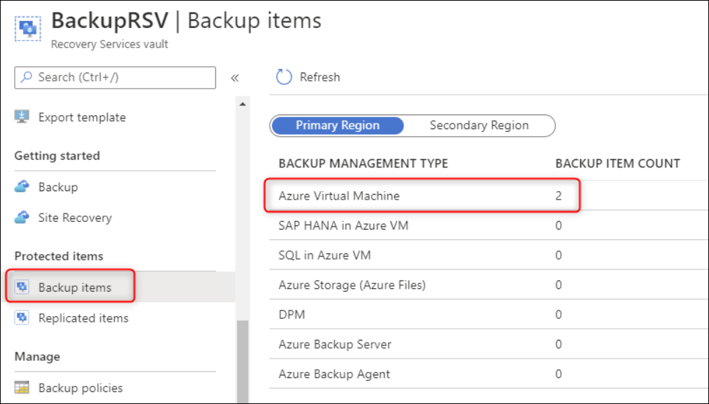

6.  Select **Azure Virtual Machine**. The 'Backup Items (Azure Virtual Machine' blade loads, listing **WebVM1** and **WebVM2**. In both cases, the 'Last Backup Status is 'Warning (Initial backup pending)'.

    ")

7.  Select **View details** for **WebVM1** to open the 'WebVM1' backup status blade. Select **Backup now**, leave the default backup retention, and select **OK**.

    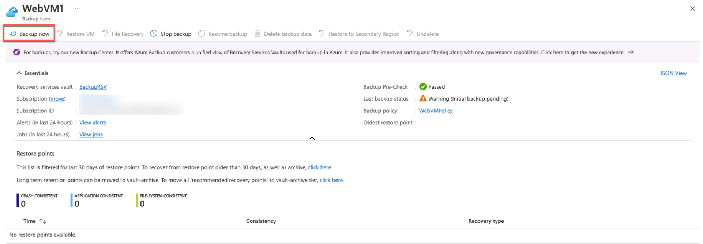

    

    >**Note:** The backup policy created earlier determines the retention period for scheduled backups. For on-demand backups, the retention period is specified separately.

8.  Close the WebVM1 backup status blade. Then, repeat the above step to trigger an on-demand backup for **WebVM2**.

9.  From the **BackupRSV** Recovery Services vault blade, under 'Monitoring', select **Backup Jobs** to load the Backup Jobs blade. This shows the current status of each backup job. The blade should show two completed jobs (configuring backup for WebVM1 and WebVM2), and two in-progress jobs (backup for WebVM1 and WebVM2).

    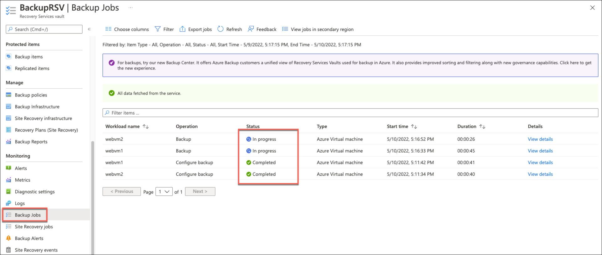

10.  Select **View Details** for **WebVM1** to open the backup job view. This backup job view shows the detailed status of the tasks within the backup job.

   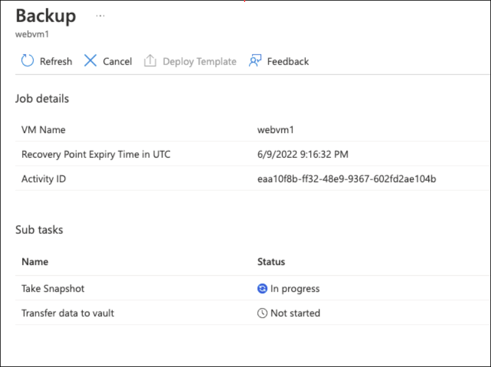

   > **Note**: To restore from a backup, it suffices that the 'Take Snapshot' task is complete. Transferring the data to the vault does not need to be complete, since recent backups can be restored from the snapshot.

You can proceed to the next task without waiting for the backup jobs to complete.


### Task 3: Enable Backup for the SQL Server tier

In this task, you will configure backup for the SQL Server database.

There are two approaches to backup for SQL Server running on Azure VMs. One uses native SQL managed backup to Azure storage. The other uses Azure Backup. For this lab, you will use Azure Backup.

Before enabling Azure Backup, you will first register the SQL Server VMs with the SQL VM resource provider. This resource provider installs the **SqlIaaSExtension** onto the virtual machine. Azure Backup uses this extension to configure the `NT SERVICE\AzureWLBackupPluginSvc` account with the necessary permissions to discover databases on the virtual machine.

1. In a new browser tab, navigate to **[Cloudshell](https://portal.azure.com/#cloudshell/)** and open a **PowerShell** session.

2. Unless you have done so previously, you will need to register your Azure subscription to use the `Microsoft.SqlVirtualMachine` resource provider. In the Cloud Shell window, execute the following command:

    ```PowerShell
    Register-AzResourceProvider -ProviderNamespace Microsoft.SqlVirtualMachine
    ```
    

    > **Note:** It may take several minutes to register the resource provider. Wait until the registration is complete before proceeding to the next step. You can check the registration status using `Get-AzResourceProvider -ProviderNamespace Microsoft.SqlVirtualMachine`.


3. Register **SQLVM1** with the resource provider by executing the following command in the Cloud Shell window. Ensure that **-Location** matches the location SQLVM1 is deployed.

    ```PowerShell
    New-AzSqlVM -Name 'SQLVM1' -ResourceGroupName 'ContosoRG1' -SqlManagementType Full -Location '[location]' -LicenseType PAYG
    ```

    
    
    > **Note:** Make sure you replace [location] with the ContosoRG1 resource group location.

    > **Note:** This will register the resource provider using the `Full` management mode. This causes the SQL service to restart, which may have an impact on production applications. To avoid this restart in production environments, you can alternatively register the resource provider in `LightWeight` mode, and upgrade later during a scheduled maintenance window.

4. Register **SQLVM2** and **SQLVM3** with the resource provider using the following commands. Ensure you specify the correct locations.

    ```PowerShell
    New-AzSqlVM -Name 'SQLVM2' -ResourceGroupName 'ContosoRG1' -SqlManagementType Full -Location '[location1]' -LicenseType PAYG
    New-AzSqlVM -Name 'SQLVM3' -ResourceGroupName 'ContosoRG2' -SqlManagementType Full -Location '[location2]' -LicenseType PAYG
    ```
    
    > **Note:** Make sure you replace [location1] with the ContosoRG1 resource group location and [location2] with the ContosoRG2 resource group location.
    
    > **Note:** This lab uses SQL Server under a 'Developer' tier license. When using SQL Server in production at the 'Standard' or 'Enterprise' tier, you can specify `DR` as the license type for failover servers (each full-price server includes a license for 1 DR server). This reduces your licensing cost significantly. Check the SQL Server licensing documentation for full details.

5. In the Azure portal, navigate to the **ContosoRG1** resource group. You should see that in addition to the SQLVM1 and SQLVM2 virtual machines, there are now parallel SQLVM1 and SQLVM2 resources of type 'SQL virtual machine' These additional resources provide additional management capabilities for SQL Server in Azure virtual machines. 

    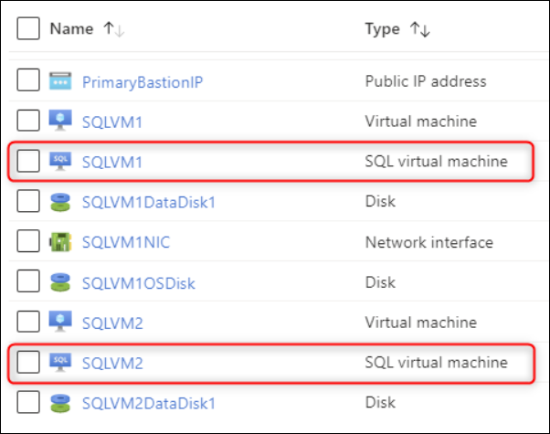

6. Select the **SQLVM1** virtual machine (the standard VM resource, not the SQL virtual machine resource). Then select **Extensions + application**. Note that the **SqlIaaSExtension** has been installed on the virtual machine.

    

With the SQL virtual machine resources created and the SQL IaaS extension installed, you can now configure Azure Backup for virtual machines.

7. In the Azure portal, navigate to the **BackupRSV** Recovery Services Vault resource in **ContosoRG1**. Under 'Getting started', select **Backup**. Under 'Where is your workload running?', select **Azure**. Under 'What do you want to backup?', select **SQL Server in Azure VM**. Then select **Start Discovery**.

   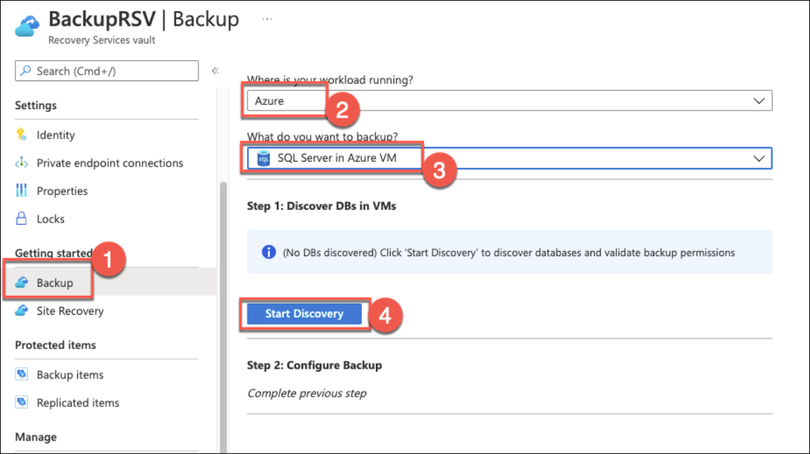

8. In the 'Select Virtual Machines' blade, select **SQLVM1** and **SQLVM2**, then select **Discover DBs**.

    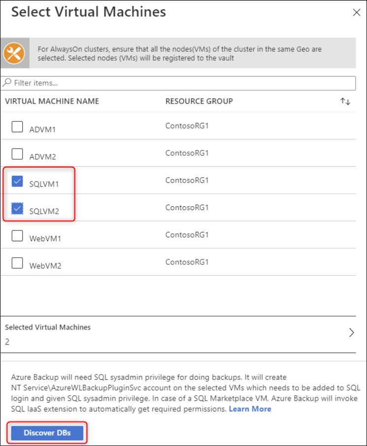

9. This will trigger a deployment. Wait for the deployment to complete (this may take several minutes).

    

10. On the 'BackupRSV' blade, select **Configure Backup**. 

    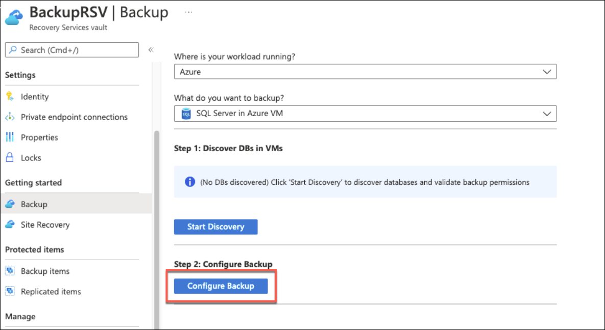

11. On the 'Backup' blade, select **Add**.

    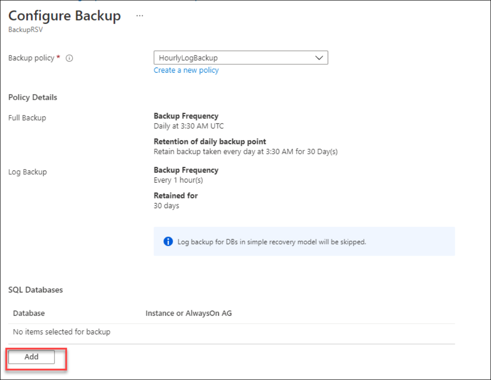

12. On the 'Select items to backup' blade, select the **\>** icon next to the `BCDRAOG\BCDRAOG` entry to show the databases. Note that the ContosoInsurance database is listed. Change the **AutoProtect** setting for BCDRAOG to **ON**, then select **OK**.

    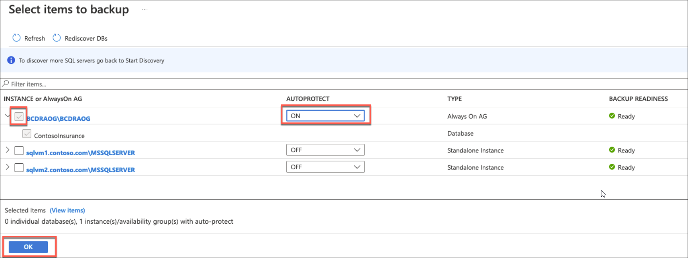

    > **Note:** Using AutoProtect backups up the current database and any future databases on this Always On Availability Group.

    > **Note:** You may also want to backup system databases on each of the SQL Servers.

13. On the 'Backup' blade, note that **BCDRAOG\BCDRAOG** is now listed for backup. Leave the policy as the default `HourlyLogBackup` policy. Select **Enable Backup** and wait for the deployment to complete.

    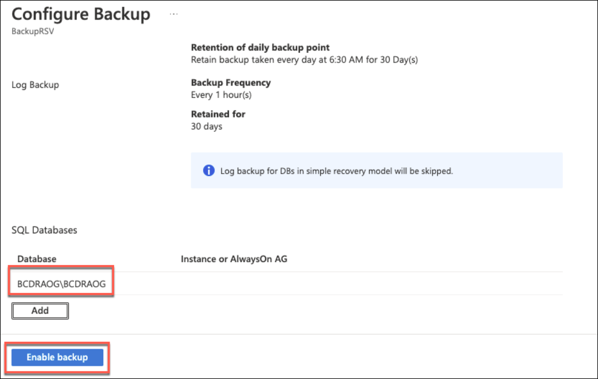

14. In the **BackupRSV** Recovery Service Vault, navigate to the **Backup Jobs** view. You should see a backup configuration job in progress for the ContosoInsurance database. (If this job does not show immediately, wait a minute and then select **Refresh**.)

    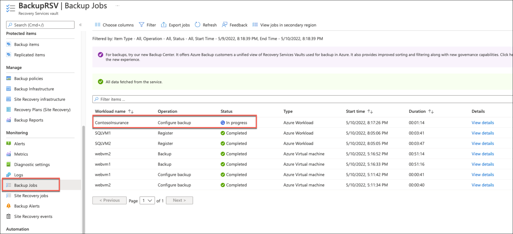

15.  Wait for the backup configuration job to complete. Use the **Refresh** button to monitor progress. The configuration job will take several minutes.

16. Select **Backup items**, then select **SQL in Azure VM**.

    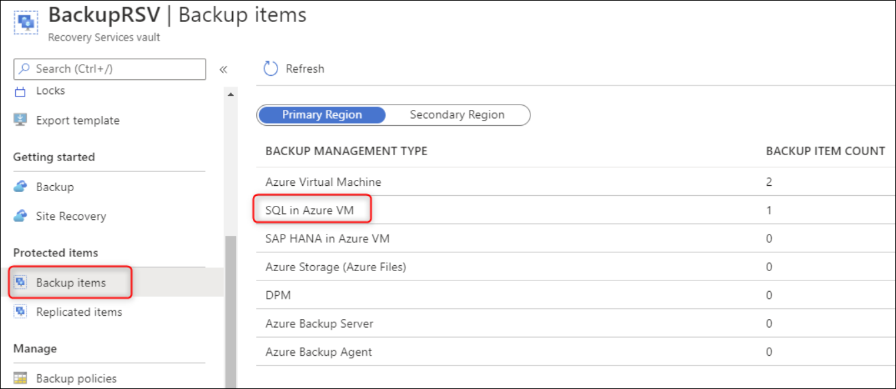

17. From the backup items list, note that the **contosoinsurance** database has status **Warning (Initial backup pending)**.

    

18. Select **View details** on the **contosoinsurance** database and select **Backup now**

      

19.  Review the default backup settings, then select **OK** to start the backup.

      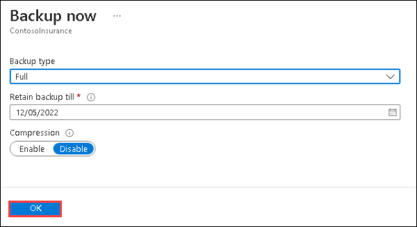

20. The backup process starts. You can monitor progress from the **Backup Job** pane.

    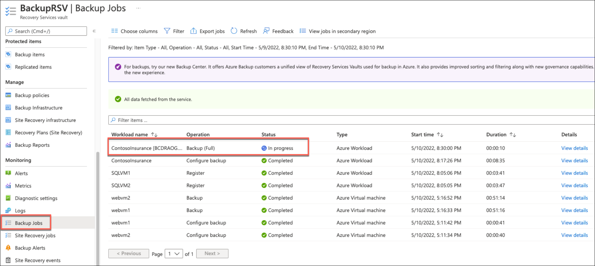

    > **Note:** You can continue to the next step in the lab without waiting for the backup job to complete.
